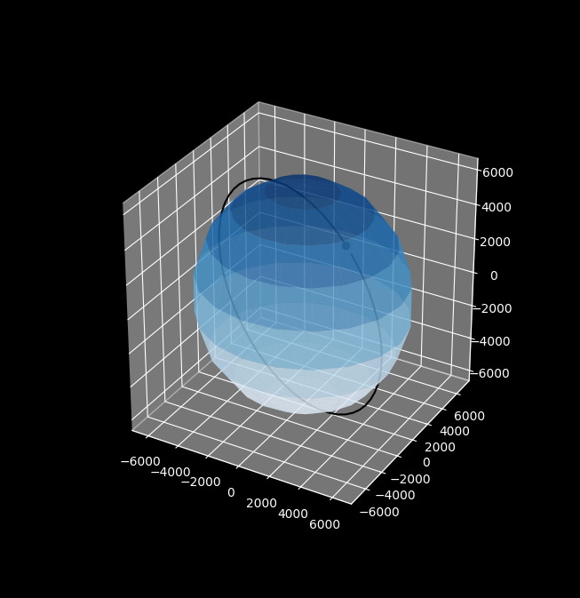
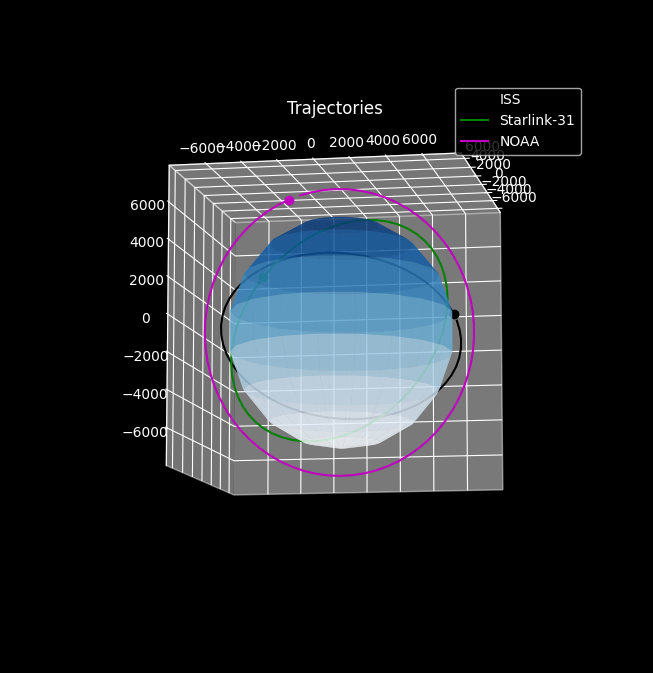

A great portion of information about OrbitPropagation was taken from videos of Alfonso Gonzalez 
<a href="https://www.youtube.com/watch?v=7SLwFzi_1cY&list=PLOIRBaljOV8gn074rWFWYP1dCr2dJqWab&index=1"> See the playlist here </a>
  
Step-by-Step Algorithm used for converting Orbital Elements to state vectors in ECI frame of reference:
 
<a href="https://downloads.rene-schwarz.com/download/M001-Keplerian_Orbit_Elements_to_Cartesian_State_Vectors.pdf">Click Here </a>
  
TO DO:
  i) Add perturbations in orbit propagation
 
 
Example Plots: 
  

